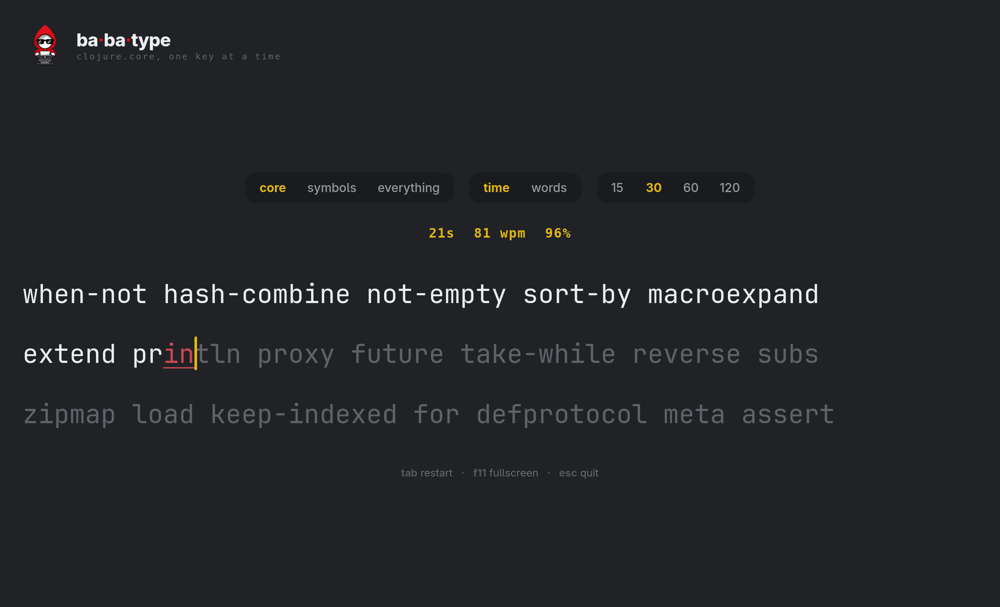
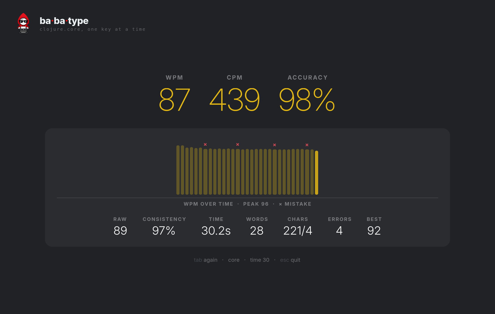

# Babatype

**A typing test in the shape of [Monkeytype](https://monkeytype.com), whose
words are the names of `clojure.core`'s public vars.** They are read out of the
running interpreter at boot. No word list ships with it: the app types the
language it is written in.

> [!WARNING]
> **Early, and for fun.** Babatype runs on
> [gtkiccup](https://github.com/brdloush/gtkiccup), which is itself an early
> proof of concept. Expect rough edges, and changes without notice.

<p>
  
  
</p>

## What it is

- **Three difficulties that fall out of the names.** `core` is the plain ones,
  `symbols` adds `->>` `some?` `swap!` `*ns*`, and `everything` adds the
  monsters, up to `set-agent-send-off-executor!`.
- **Against the clock or a word count**: 15, 30, 60 or 120 seconds, or 10,
  25, 50 or 100 words.
- **Results like the original**: wpm and cpm, accuracy, raw speed,
  consistency, a per-second chart with a mark on every second that held a
  mistake, and your best run so far (kept until you quit).
- **A native GTK4 app**, not a web page. It starts maximized, renders nothing
  while you are not typing, and needs no libadwaita, so it runs wherever GTK4
  does.
- **A [babashka](https://babashka.org) script.** No JVM and no build step: bb
  calls GTK directly through its FFI.

## Keys

| key | does |
| --- | --- |
| type | the test starts on the first key |
| `backspace` | undoes a character; a mistake still counts |
| `tab` | restart with new words |
| `F11` or `F5` | fullscreen, and back |
| `F3` | the GTK inspector, with a live frame rate |
| `esc` | quit |

## Run it

You need:

- **babashka 1.13.220 or later.** On Linux, the dynamically linked build: the
  static (musl) build cannot load system libraries.
- **GTK4.**
- **git.** [gtkiccup](https://github.com/brdloush/gtkiccup) has no release
  yet, so `bb.edn` names one of its commits, and babashka clones it on the
  first run.

It runs on Linux, macOS and Windows.

On Debian/Ubuntu (babashka from [its install
page](https://github.com/babashka/babashka#installation)):

```bash
sudo apt install libgtk-4-1
git clone https://github.com/brdloush/babatype
cd babatype
bb babatype
```

On macOS, with [Homebrew](https://brew.sh) (first run on a Mac, and these
steps, by [@jirkapenzes](https://github.com/jirkapenzes) — thank you!):

```bash
brew install borkdude/brew/babashka gtk4
git clone https://github.com/brdloush/babatype
cd babatype
bb babatype
```

On Windows 11, put these on `PATH` (one folder each is fine):

- `bb.exe`, from `babashka-*-windows-amd64.zip` on [babashka's
  releases](https://github.com/babashka/babashka/releases);
- GTK4's `bin` folder, from `GTK4_Gvsbuild_*_x64.zip` on [gvsbuild's
  releases](https://github.com/wingtk/gvsbuild/releases), a ready-built GTK
  from the gvsbuild project that
  [gtk.org](https://www.gtk.org/docs/installations/windows/) names (GTK from
  MSYS2 should work too, but is not tried);
- [Git for Windows](https://git-scm.com/download/win).

Then, the same three lines as above:

```
git clone https://github.com/brdloush/babatype
cd babatype
bb babatype
```

If `bb` exits at once and prints nothing, Windows lacks the Visual C++
runtime it needs. A fresh install does not have it; most used PCs got it from
some other installer. Install the [Microsoft Visual C++
Redistributable](https://aka.ms/vc14/vc_redist.x64.exe).

On Linux, to give it its own icon and name in the app grid and the switcher:

```bash
bb install-desktop      # one .desktop file and one icon, in ~/.local/share
bb uninstall-desktop    # removes exactly what it wrote
```

## More

| | |
| --- | --- |
| [Design notes](docs/design.md) | why the passage is one label, how the caret slides between characters, why ligatures are off, how mistakes are scored |
| `bb test` | the tests: the engine and word list are pure; the caret and inspector tests open a window |
| `bb shot babatype` | redraws `docs/images/babatype.png` (also `babatype-results`) |
| `bb tasks` | everything else |

## License

[MIT](LICENSE)
