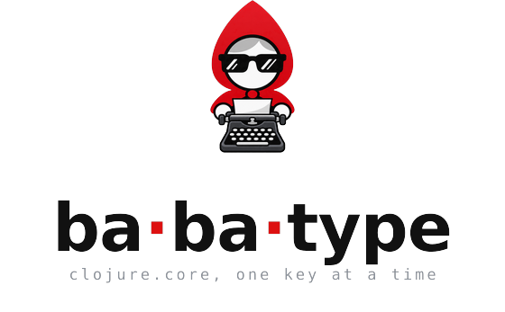

# Design notes

Why Babatype is built the way it is. Most of these were found the hard way, and
each was screenshotted before it was settled.

## The look

Babatype needs **no libadwaita**: the look is its own
CSS over the Adwaita stylesheet GTK4 already carries, and the window is
gtkiccup's `ui/chromeless-window`. So it runs wherever GTK4 runs, not only on GNOME.

Difficulty falls out of the names themselves -- `core` is the plain ones,
`symbols` adds `->>` `some?` `swap!` `*ns*`, and `everything` adds the monsters
up to `set-agent-send-off-executor!`.

## The passage

The passage is **one `GtkLabel`**. Per-character colour, the caret and the error
underlines are all Pango markup, rebuilt on each keystroke -- about **0.17 ms**
for a full passage. A widget per character, which is the direct translation of
what Monkeytype does in the browser, would churn hundreds of widgets a second
for no visible gain.

## Keys and the inspector

It **starts maximized**: a typing test wants room, but taking the whole screen
unasked is too much. `F11` (or `F5`) goes fullscreen and back. `tab` restarts,
`esc` leaves.
`F3` opens the GTK inspector, whose *Frames* page shows the real frame rate;
`gtk_window_set_interactive_debugging` needs no `GTK_DEBUG=interactive` and no
keybinding setting, and toggling it off only hides the window, so its frame
history survives. It keeps a frame clock running while it is open, so an idle
window is not idle while you watch it through the inspector.

## The caret

**The caret is a 3px bar between characters**, not a block over one -- a
floated widget in a `GtkOverlay`, moved into place by asking the label's Pango
layout where the next character starts. A background span could only ever cover
a whole character cell, and inserting a bar into the text would shift everything
after it.

Nothing measured from a laid-out widget is available during a render: GTK lays
the frame out afterwards, so on the first render the label has no size yet.
`notify::width` and a tick callback both fire too early as well -- both still
report a height of zero. So the caret is placed at two moments:

- **after each painted frame**, through gtkiccup's `:on-layout`, which hangs
  off the frame clock's `after-paint` signal: the first point in a frame where
  layout is done. That covers the first frame and any resize.
- **after each render**, through `:on-render`. Once the label has been laid
  out, its new text can be measured straight away, so the caret moves in the
  same frame as the text. This one matters for a window that is not painting
  -- hidden behind another, say -- where frames alone would leave the caret
  behind the cursor.

The second moment has a cost on the first render: asking the label for its
layout makes GtkLabel build one, and it keeps it until the text changes. So
the CSS has to be in place before that render, which is why it goes to
gtkiccup's `run` as `:css` rather than being loaded from `:on-ready`. Loaded
late, the first screen came up in the default ~11pt font, caret too, and stayed
that way until the first key. A decorated window hid this, because something
later restyled the whole window. The chromeless one does not, unless the
window manager changes the window's state, which is why opening a second
window seemed to fix it.

That also makes an idle window idle. Before, the app re-rendered every 400ms
even while nobody typed, only so that some render would land after the first
layout. Now nothing renders until a key is pressed, and painted frames stop
when nothing changes. Measured: no renders and no
`:on-layout` calls in ten idle seconds, and about 0.1% of a core -- one tick of
the kernel's clock -- from the two threads that sleep until a test starts.

## Ligatures

**Ligatures are off.** A font like JetBrains Mono renders `->` as a single
arrow glyph and `<=` as `≤`, which for a typing test is actively wrong: two
characters become one cell, so the caret and the per-character colours land in
the wrong place, and `<=` is hard to aim at.

Only Pango's own attribute turns them off:

```clojure
"<span font_features='liga=0,calt=0,dlig=0,clig=0'>...</span>"
```

Wrapping each character in its own `<span>` does **not** stop them, and GTK's
CSS `font-feature-settings` silently does nothing at all. Both were tried and
screenshotted before settling on the attribute.

## Line breaks

**The line breaks are ours, not Pango's.** Wrapping is turned off and the
passage is split into fixed 52-character lines at word boundaries, three of them
on screen at a time. The target itself is unaffected -- just the
words joined by spaces -- and a line swallows the space that follows it, so the
caret has somewhere visible to sit at a break. Letting Pango wrap looked fine standing still and was
wrong in motion: it re-flows whenever the text changes, so the paragraph slid
sideways under a stationary caret instead of scrolling a line at a time. It also
cheerfully broke `keep-indexed` across two lines, which for a Clojure name is
nonsense. Fixed spans give a layout that does not move, and `babatype.engine`
computes them, so the behaviour is tested rather than eyeballed.

## The results

The results chart is built from plain boxes whose height is a size request, with
a red cross over any second that contained a mistake -- the same idea as the
reference's error axis. No drawing API, because we still do not have one.

Mistakes are counted from the keystroke log, so backspacing does not un-make
one: the wrong key was still pressed. `ERRORS` is the total; the crosses say
when, and each carries a tooltip with the count for that second.

## Scoring

**Space is just another character.** The target is one flat string, gaps
included, and every keystroke is scored against the character under the cursor.
Typing a space where a letter belongs is a mistyped character; typing a letter
where the gap between two words belongs is equally a mistake. Nothing about the
space bar commits a word or skips ahead.

That falls out well: a *substitution* costs one position and the rest of the
passage stays aligned, so one typo does not poison everything after it. The
honest trade is that an *insertion* -- an extra character nobody asked for --
does put you out of step until you backspace, where Monkeytype's word-by-word
model would absorb it. In exchange there is no way to overrun a word, so nothing
can shove the passage sideways as you type.

`src/babatype/engine.clj` is the whole test as a pure state machine and
`src/babatype/words.clj` the word list; both are covered without opening a
window.

## The icon

The mark is babashka's hooded red head in black sunglasses, sat at a
typewriter (`icons/babatype-logo.svg` is the source, `icons/cz.brdloush.Babatype.png`
the 512 px icon). It is also the icon the app draws in its own header, from the
same file, so the header and the switcher cannot drift apart.


